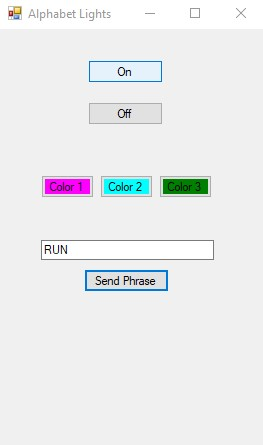
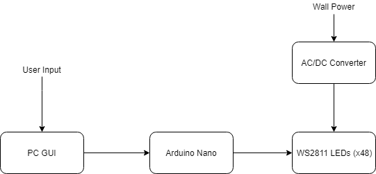

# Alphabet-Lights
Alphabet Lights is a recreation of the Christmas light wall from Stranger Things season 1.

# Example
The following example shows the behavior of the lights when the phrase "RUN" is sent using the GUI.
 

# Hardware Used
1. 50 bulb strand of 5V WS2811 RGB LED Pixels https://www.amazon.com/gp/product/B01AG923GI/ref=oh_aui_detailpage_o04_s00?ie=UTF8&psc=1
2. 5V 8A AC/DC Converter https://www.amazon.com/gp/product/B00MHV7576/ref=oh_aui_detailpage_o04_s00?ie=UTF8&psc=1
3. Arduino Nano https://www.amazon.com/Arduino-A000005-ARDUINO-Nano/dp/B0097AU5OU/ref=olp_product_details?_encoding=UTF8&me=
4. Windows Laptop

# Libraries Used
FastLED http://fastled.io/

# Block Diagram

A Windows Forms GUI is used to send commands to the Arduino Nano. There are four commands available to the user in the GUI:
1. On - Turns on each letter's LED
2. Off - Turns off all LEDs
3. Change Color(s) - Changes the colors of the enabled LEDs. Users can select up to three different colors at one time.
4. Send Phrase - Displays a given phrase letter-by-letter on the LEDs.

The Arduino Nano receives these commands over a USB serial connection with the Windows laptop. The Arduino program parses incoming commands and uses the FastLED library to send the corresponding outputs to the array of LEDs over a digital I/O port. 

A 5V 8A power adapter is used to step down the voltage from a wall connection and convert it from AC to DC. This adapter powers the array of LEDs.

# Future Improvements
1. The GUI could include additional functions to give the user more control over the LEDs (brightness control, different color patterns, etc.)
2. A mobile application could be developed to allow for remote control of the LEDs using either a Bluetooth or Wi-Fi connection.
